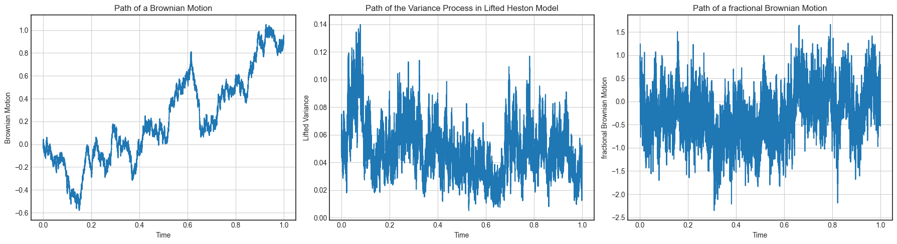
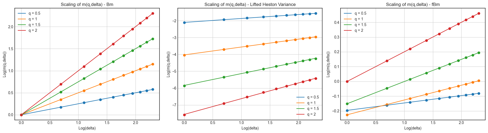
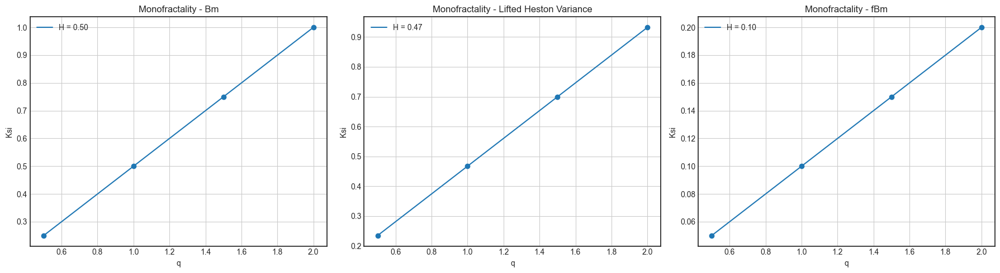
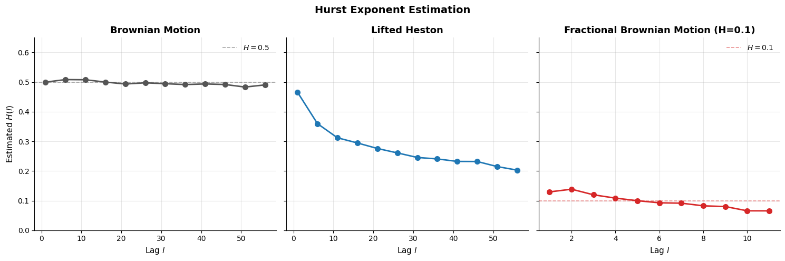

# Hurst Exponent Estimation

## Introduction

The **Hurst exponent** $H \in (0,1)$ characterizes the regularity of a 
stochastic process. More precisely, it governs the scaling of its increments:

$$\mathbb{E}\left[|X_{t+\Delta} - X_t|^2\right] \sim \Delta^{2H}$$

- $H = 0.5$ in a standard Brownian motion, the increments are independent and 
  the path is "moderately" rough
- $H < 0.5$: the process is **rougher** with negatively correlated 
  increments and highly irregular paths
- $H > 0.5$: the process is **smoother** with persistent increments

In classical stochastic volatility models such as Black-Scholes, 
volatility is driven by a standard Brownian motion ($H = 0.5$). 
However, empirical studies (Gatheral et al., 2018) reveal that **realized 
volatility behaves more like a fractional Brownian motion with $H \approx 0.1$**. 
This roughness is not merely theoretical, in fact, it's directly linked to the **explosive short-term ATM skew** observed in options markets.

The question is the following: does the **Lifted Heston 
variance process**, despite being a conventional semimartingale, exhibit 
the same rough behavior? To answer this, we'll simulate paths of three 
processes and visually compare them before formally estimating $H$. 

>See the corresponding notebook [`Hurst Estimation`](../notebooks/hurst_estimation.ipynb)

## 1 - Simulation Methods

### a - Standard Brownian Motion

A standard BM path is simulated on $[0,1]$ with $m$ uniform steps:

$$W_{t_{k+1}} = W_{t_k} + \sqrt{\Delta t} \, Z_k, \quad Z_k \sim \mathcal{N}(0,1)$$

--- 
### b - Fractional Brownian Motion (Cholesky method)

A fBM $W^H$ with $H = 0.1$ is simulated via the **Cholesky decomposition** 
of the covariance matrix:

$$\Gamma_{ij} = \frac{1}{2}\left(t_i^{2H} + t_j^{2H} - |t_i - t_j|^{2H}\right)$$

We draw $W^H = L Z$ where $L$ is the Cholesky factor of $\Gamma$ and 
$Z \sim \mathcal{N}(0, I)$.

---
### c - Lifted Heston Variance Process

The variance process $V^n$ is the spot variance of the Lifted Heston model and is computed through **Implicit-explicit Euler scheme** on $[0,1]$ with $m = 10^5$ and $\Delta t = 10^{-5}$: 

$$\hat{V}_{t_k} = g_0(t_k) + \sum_{i=1}^{n} c_i \hat{U}^i_{t_k}$$

with

$$\hat{U}^i_0 = 0, \qquad \hat{U}^i_{t_{k+1}} = \frac{1}{1 + x_i \Delta t} 
\left( \hat{U}^i_{t_k} - \lambda \hat{V}_{t_k} \Delta t 
+ \nu \sqrt{\max(0, \hat{V}_{t_k})} \,(W_{t_{k+1}} - W_{t_k}) \right)$$

and the **initial curve**:

$$g_0(t) = V_0 + \lambda \theta \sum_{i=1}^{n} c_i \int_0^t e^{-x_i(t-s)} ds$$

with **weights** and **mean reversions**:

$$c_i = \frac{r^{1-\alpha} - 1}{\Gamma(\alpha)\Gamma(2-\alpha)} r^{(1-\alpha)(i - 1 - n/2)}, \qquad
x_i = \frac{(1-\alpha)}{ (2-\alpha)} \frac{r^{2-\alpha}-1}{r^{1-\alpha}-1} r^{i-1-n/2}$$

## 2 - Path Visualization

The figure below compares three simulated paths over $[0,1]$. The BM serves 
as a smooth reference ($H=0.5$), the fBM as a rough ground truth ($H=0.1$), 
and the Lifted Heston variance $V^n$ as our model of interest.

The simulation uses the following parameters ($n = 20$ factors):

| $V_0$ | $\lambda$ | $\theta$ | $\nu$ | $H$ | $\alpha$ | $r_{20}$ |
|:---:|:---:|:---:|:---:|:---:|:---:|:---:|
| 0.05 | 0.3 | 0.05 | 0.1 | 0.1 | H + 0.5 =0.6 | 2.5 |

**Observation:** The Lifted Heston variance path shows high-frequency 
oscillations that closely resemble the fBM path ($H = 0.1$). This 
visual similarity motivates the formal estimation of H in the next section.

## 3 - Experiment 1: Daily Timescales

Let's take a look at the **Moments of log-volatility increments**:

$$\mathbb{E}\left[|\log(\sigma_{t+\Delta}) - log(\sigma_t)|^q\right] \quad \text{or} \quad
m(q, \Delta) = \frac{1}{M_\Delta} \sum_{i=1}^{M_\Delta} |\log(\sigma_{t_i + \Delta}) - \log(\sigma_{t_i})|^q$$

where $t_{M_\Delta} + \Delta$ is the index of the last point in the series.

And by observing the **Moments of fBm increments**:

$$\mathbb{E}\left[|W^H_{t+\Delta} - W^H_t|^q\right] = K_q \Delta^{qH}$$

where $K_q$ is the moment of order $q$ of the absolute value of a standard Gaussian.

We observe that the key question is therefore whether the log-log plot of $m(q,\Delta)$ against $\Delta$ is **empirically linear**:

$$\log(m(q,\Delta)) \approx \zeta_q \log(\Delta) + C_q$$

If the regression yields a good linear fit and $\zeta_q \approx \hat{H} \cdot q$, this would confirm that the Lifted Heston variance process **behaves like a rough process locally**, mimicking a fBM with Hurst exponent $\hat{H} < 0.5$. This is precisely what the experiment aims to verify empirically.

For $q \in \{0.5, 1, 1.5, 2\}$, $\Delta = 1, \ldots, 10$ days:

**Observation**: The Lifted Heston variance lines are linear with slopes intermediate between BM and fBM, yielding $\hat{H} \approx 0.47$ at the variance level. This is expected because $V^n$ is a semimartingale, so its raw increments behave similarly to a standard BM.

**Observation**: We can see that in all three cases, $\zeta_q$ is **linear in $q$**, 
confirming **monofractality** ($\zeta_q = \hat{H} \cdot q$)

> **Note:** We estimated $H$ on the **variance** $V^n$ and not the volatility 
> $\sigma = \sqrt{V^n}$. The paper estimated $H$ on $\sigma$ which explains 
> the difference: $\hat{H} \approx 0.47$ here vs $\approx 0.19$ in the paper.

## 4 - Experiment 2: Intra-day Timescales

The autocorrelation of $\sigma$ satisfies the following regression for a 
process with Hurst exponent $H$:

$$\log(1 - \rho_\sigma(k\Delta)) = b + 2H \log(k\Delta), \quad k = 1, \ldots, K$$

We will estimates $H$ on subsamples of increasing lag $l$ to reveal how it evolves across timescales:

**Observation**: The Lifted Heston $\hat{H}(l)$ stabilizes around $\hat{H} \approx 0.2$, confirming convergence of the estimator.

> **Note on fBM:** We restricted lags to $l \leq 10$ for the fractional Brownian motion 
> (`m = 10^4` steps). Beyond this, the estimator diverges due to insufficient data.

## Summary

The Lifted Heston is a semimartingale and is faster to simulate than the Rough Heston model. Moreover, its variance process exhibits rough behavior to any statistical estimator with $\hat{H} \approx 0.47$ at daily timescales (Exp. 1) decreasing toward $\hat{H} \approx 0.20$ at finer timescales (Exp. 2) as described in Abi Jaber, E. (2019).

>The full implementation and numerical results are available here: [`Hurst Estimation`](../notebooks/hurst_estimation.ipynb)

#### Next Section

We will now exploit the Markovian structure of the Lifted Heston model to price European options via the Carr-Madan formula and study the convergence of implied volatility smiles as $n \to \infty$:

[`Implied Volatility in the Lifted Heston model`](lifted_heston_iv.md)

## References
- Abi Jaber, E. (2019). *Lifting the Heston model*. Quantitative Finance.
- El Euch, O., Rosenbaum, M. (2019). *The characteristic function of rough Heston models*. Mathematical Finance.
- Gatheral, J., Jaisson, T., Rosenbaum, M. (2018). *Volatility is rough*. Quantitative Finance.