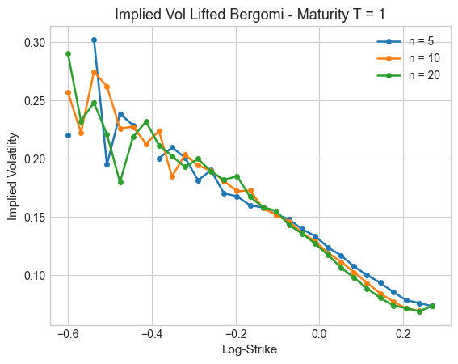

## Introduction

In the [`Lifted Heston section`](lifted_heston_iv.md), we priced European options using the **Carr-Madan formula** applied to a closed-form characteristic function thanks to the affine structure of the Lifted Heston model. However, **Lifted Bergomi model** drops this assumption. We therefore switch to **Monte Carlo simulation** to price options and extract implied volatility smiles. This section addresses two key questions:
- How do we **simulate** the Lifted Bergomi model through its multi-factor Markovian structure ?
- How does the **number of factors n** impact the implied volatility smile ?

> See the corresponding notebook [`Implied Volatility in the Lifted Bergomi model`](../notebooks/lifted_bergomi_iv.ipynb)

## 1 - Mathematical Framework

### From Rough Bergomi to Lifted Bergomi

In the **Rough Bergomi model**, the spot variance takes the form:

$$
V_t = \xi_0(t) \exp\left(\eta\sqrt{2H} \int_0^t (t-s)^{H-\frac{1}{2}} dW_s - \frac{1}{2}\eta^2 t^{2H}\right)
$$

where the non-Markovian kernel $(t-s)^{H-\frac{1}{2}}$ makes direct simulation costly. Following the same **multi-factor approximation** used in the Lifted Heston model, we have:

$$
\frac{1}{\Gamma\left(H+\frac{1}{2}\right)} \int_0^t (t-s)^{H-\frac{1}{2}} dW_s \approx \int_0^t K^n(t-s)\,dW_s = \sum_{i=1}^{n} c_i Y_t^i
$$

where $K^n(t) = \sum_{i=1}^{n} c_i e^{-x_i t} \approx \frac{t^{H-\frac{1}{2}}}{\Gamma(H+\frac{1}{2})}$ and each factor $Y^i$ follows a mean-reverting Ornstein-Uhlenbeck process ( $dY_t^i = -x_i Y_t^i \, dt + dW_t, \quad Y_0^i = 0$ ).

This defines the **Lifted Bergomi model**:

$$
V_t^n = \xi_0(t) \exp\left(\eta\sqrt{2H}\,\Gamma\!\left(H+\tfrac{1}{2}\right)\int_0^t K^n(t-s)\,dW_s - H\eta^2\Gamma^2\!\left(H+\tfrac{1}{2}\right)\int_0^t (K^n(s))^2\,ds\right)
$$

$$
dS_t^n = S_t^n\sqrt{V_t^n}\,dB_t
$$

with $d\langle B, W\rangle_t = \rho\,dt$.

### Monte Carlo Pricing

Pricing of an European calls by direct simulation:

$$
C_0 = e^{-rT}\,\mathbb{E}\left[(S_T^n - K)^+\right]
$$

## 2 - Implied Volatility Smiles

We plotted implied volatility smiles and will compare them for two maturities and various **$\text{n}_\text{factors}$** (5, 10, 20) under the following parameters:

$$
H = 0.07, \quad \eta = 1.9, \quad \rho = -0.9, \quad S_0 = 1, \quad \xi_0(t) \equiv 0.02
$$

Results are shown for a single maturity $T$. Short-maturity results are not presented: the combination of rough variance paths and exponential nonlinearity makes Monte Carlo convergence expensive at $T \ll 1$.  

**Observation**: The curves are **noisy and unstable in the wings** (log-strike $< -0.4$), a Monte Carlo artifact caused by too few paths reaching extreme strikes. Near the money (log-strike $> -0.2$), the three curves align well and convergence in $n$ is clear.

## Summary

| Feature | Lifted Heston | Lifted Bergomi |
|:-------:|:-------------:|:--------------:|
| Pricing method | Carr-Madan (FFT) | Monte Carlo |
| Characteristic function | Closed-form | Not available |
| Convergence in $n$ | Fast (long mat) / Slow (short mat) | Moderate |
| Skew generation | Moderate | Steep |
| Short maturity | Tractable | Expensive |

The Lifted Bergomi model generates a **steeper skew** than its Heston counterpart. This comes at a cost: without a closed-form characteristic function, pricing relies entirely on Monte Carlo simulation which introduces **noise in the wings** and becomes **expensive at short maturities**.

> The full implementation and numerical results are available here: [`Implied Volatility in the Lifted Bergomi model`](../notebooks/lifted_bergomi_iv.ipynb)

## References
- Bayer, C., Friz, P., Gatheral, J. (2016). *Pricing under rough volatility*. Quantitative Finance.
- Abi Jaber, E. (2019). *Lifting the Heston model*. Quantitative Finance.
- El Euch, O., Rosenbaum, M. (2019). *The characteristic function of rough Heston models*. Mathematical Finance.
- Gatheral, J., Jaisson, T., Rosenbaum, M. (2018). *Volatility is rough*. Quantitative Finance.