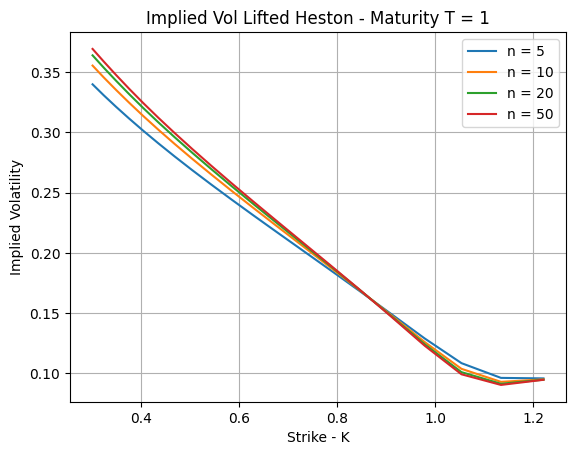
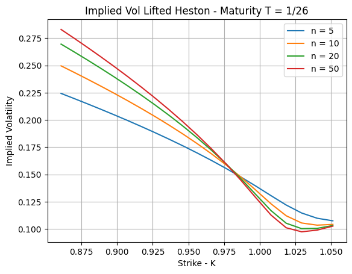

# Implied Volatility in the Lifted Heston Model

## Introduction

In the [`Hurst Estimation section`](hurst_estimation.md), we simulated the 
variance process of the **Lifted Heston model** with $n = 20$ factors and estimated its 
Hurst exponent $H$ which confirmed the **rough behavior** of the variance process

The Lifted Heston model generates this rough behavior through a **multi-factor 
Markovian structure**: as $n \to \infty$, the weighted sum of Ornstein-Uhlenbeck 
factors converges to a fractional Brownian motion with $H < 0.5$.

Having validated this convergence at the **process level**, we now ask what it implies 
at the **pricing level**. This section focuses on two key questions:
- How do we **price European options** in this model ?
- How does the **number of factors n** impact the implied volatility smile ?

>See the corresponding notebook [`Implied Volatility in the Lifted Heston model`](../notebooks/lifted_heston_iv.ipynb)

## 1 - Mathematical Framework

### The Characteristic Function

A key advantage of the Lifted Heston model is that its **affine structure** allows the characteristic function of the log price to take an **exponential-affine form**, making Fourier pricing methods directly applicable. Let's consider the process:

$$
M_t = \exp\left(u\log(S_t) + \phi(t,T) + \sum_{i=1}^{n} c_i \psi^i(T-t) U_t^i\right)
$$

where $\phi$ and $(\psi^i)_{i=1,\dots,n}$ are deterministic functions satisfying ODEs 
with initial conditions $\psi^i(0) = 0$. One can show via **Itô's formula** that $M$ 
is a local martingale (see **_Proof_** at the end), then, a **true martingale** since $\text{Re}(\psi) \leq 0$, which gives:

$$
M_t = \mathbb{E}\left[\exp(u\log S_T) \mid \mathcal{F}_t\right]
$$

Evaluating at $t=0$ directly yields the characteristic function:

$$
\Phi_T(u) = \mathbb{E}[\exp(iu\log(S_T))] = M_0 = \exp\left(\phi(0,T) + \sum_{i=1}^{n} c_i\psi^i(T)V_0\right)
$$

The functions $(\psi^i)$ satisfy a **system of n Riccati ODEs** solved numerically in the notebook.

### Carr-Madan Pricing Formula

Rather than inverting the characteristic function directly, we use the 
**Carr-Madan formula** to price European call options efficiently via FFT:

$$
C_0 = \frac{e^{-r_{int}T - \alpha_2 \log(K)}}{\pi} \int_0^{\infty} 
\text{Re} \left( \frac{\Phi_T(u - (\alpha_2+1)i)}{(\alpha_2 + iu)(\alpha_2 + 1 + iu)} 
e^{-i\log(K)u} \right) du
$$

where $\alpha_2 > 0$ is a damping factor introduced to ensure integrability. 
The integral is truncated at a level $L$ and approximated numerically.

## 2 - Implied Volatility Smiles
We plotted implied volatility smiles and will compare them for two maturities and various **$\text{n}_\text{factors}$** (5, 10, 20, 50) under the following parameters:

$$
S_0 = 1, \quad \rho = -0.7, \quad \lambda = 0.3, \quad \theta = 0.02, 
\quad \nu = 0.3, \quad V_0 = 0.02, \quad \alpha = 0.6
$$

| Maturity | Truncation L |
|:----------:|:--------------:|
| T = 1    | 100          |
| T = 1/26 | 1000         |

--- 
 

**Observation**: At long maturity, convergence is fast and `n = 10` is essentially indistinguishable from `n = 50`. The reason is the multi-factor structure that has time to "average out": the smile stabilizes and additional factors bring negligible corrections.

---
 

**Observation**: At short maturity, the picture changes dramatically. Convergence is slow and `n` matters significantly. It's the consequence of the fractional kernel which requires more factors. This slow convergence is itself a signature of rough volatility (`H < 0.5`): rough paths generate more extreme short-term moves. This accuracy/cost tradeoff is a critical consideration in practice for short-dated options desks where real-time pricing is required.

## Summary

| Maturity | Convergence speed | Minimum `n` for accuracy |
|:----------:|:------------------:|:----------------------:|
| T = 1    | Fast             | n ≈ 10               |
| T = 1/26 | Slow             | n > 20               |

The contrast between the two regimes illustrates the following fact: **the roughness of paths is a short-term phenomenon** and capturing it numerically requires a fine multi-factor approximation.

>The full implementation and numerical results are available here: [`Implied Volatility in the Lifted Heston model`](../notebooks/lifted_heston_iv.ipynb)

#### Next Section

The **Lifted Heston** relied on an affine structure that gave us a tractable characteristic function. The **Lifted Bergomi** drops this assumption, so we switch to Monte Carlo simulation to price options and extract implied volatility smiles.

[`Implied Volatility in the Lifted Bergomi model`](lifted_bergomi_iv.md)

## References
- Abi Jaber, E. (2019). *Lifting the Heston model*. Quantitative Finance.
- El Euch, O., Rosenbaum, M. (2019). *The characteristic function of rough Heston models*. Mathematical Finance.
- Gatheral, J., Jaisson, T., Rosenbaum, M. (2018). *Volatility is rough*. Quantitative Finance.
- Carr, P., Madan, D. (1999). *Option valuation using the fast Fourier transform*. Journal of Computational Finance.

---
### Proof: $M$ is a local martingale

To show that $M_t$ is a local martingale, it suffices to show that its drift 
(the $dt$ term) vanishes. Let $L_t = \log(S_t)$, and by Itô's formula:

$$
dL_t = \sqrt{V_t}\, dB_t - \frac{1}{2}V_t\, dt
$$

By applying Itô's formula to $M_t$:

$$
dM_t = \frac{\partial M_t}{\partial t}dt + \frac{\partial M_t}{\partial S_t}dS_t + \frac{1}{2}\frac{\partial^2 M_t}{\partial S_t^2}(dS_t)^2 + \sum_{i=1}^n\left(\frac{\partial M_t}{\partial U^i_t}dU^i_t + \frac{1}{2}\frac{\partial^2 M_t}{\partial (U^i_t)^2}(dU^i_t)^2 + \frac{\partial^2 M_t}{\partial U^i_t \partial S_t}d\langle U^i_t, S_t\rangle\right)
$$

which gives:

$$
\frac{dM_t}{M_t} = \left(-F\left(u,\sum_{i=1}^n c_i\psi^i(T-t)\right)g_0(T-t) - \sum_{i=1}^n c_i U^i_t F\left(u,\sum_{j=1}^n c_j\psi^j(T-t)\right)\right)dt + \sum_{i=1}^n c_i x_i \psi^i(T-t)U^i_t\text{dt}
$$

$$ + u\sqrt{V_t}\text{dB}_t + \frac{1}{2}V_t(u^2 - u)\text{dt} + \nu\sqrt{V_t}\sum_{i=1}^n c_i\psi^i(T-t)\text{dW}_t - \lambda V_t \sum_{i=1}^n c_i\psi^i(T-t)\text{dt} - \sum_{i=1}^n c_i x_i \psi^i(T-t)U^i_t\text{dt} $$

$$ + \frac{1}{2}\nu^2 V_t \sum_{i=1}^n c_i^2(\psi^i(T-t))^2\text{dt} + u\nu\rho V_t \sum_{i=1}^n c_i\psi^i(T-t)\text{dt} $$

The terms $\sum_{i=1}^n c_i x_i \psi^i(T-t)U^i_t$ cancel. Grouping the remaining 
$dt$ terms and using $V_t = g_0(T-t) + \sum_{i=1}^n c_i U^i_t$:

$$
\frac{dM_t}{M_t} = \left(-F\left(u,\sum_{i=1}^n c_i\psi^i(T-t)\right)\left(g_0(T-t) + \sum_{i=1}^n c_i U^i_t\right) + V_t F\left(u,\sum_{i=1}^n c_i\psi^i(T-t)\right)\right)dt+ u\sqrt{V_t}\text{dB}_t + \nu\sqrt{V_t}\sum_{i=1}^n c_i\psi^i(T-t)\text{dW}_t
$$

Since $g_0(T-t) + \sum_{i=1}^n c_i U^i_t = V_t$, the $dt$ term vanishes exactly:

$$
\frac{dM_t}{M_t} = u\sqrt{V_t}\text{dB}_t + \nu\sqrt{V_t}\sum_{i=1}^n c_i\psi^i(T-t)\text{dW}_t
$$

There is no $dt$ term, so $M_t$ is a **local martingale**.
